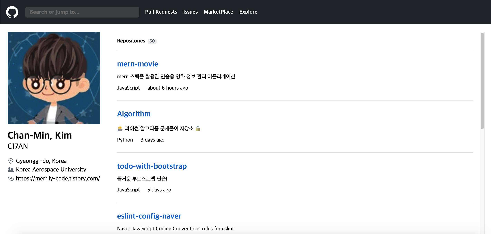

## Next.js를 활용한 깃허브 클론

-> 클론 코딩으로 시작하는 Next.js 1장 프로젝트



### 실행

```
next build
next start
```

## 새로 습득한 내용

### Next.js 프로젝트 구조
- pages 폴더에 추가한 페이지는 해당 파일명으로 라우팅됨.
- _app
  - _app 은 모든 페이지에 적용되는 컴포넌트로, 스타일 및 레이아웃을 전역으로 적용할 수 있음.
- _document
  - _document 는 기본 html 템플릿을 담당함. (public 폴더의 index.html을 대체함.)
  - _document 는 클래스 컴포넌트를 활용하며, `next/document` 의 `Document` 를 상속받음.
  - _document 는 body 안에 `<Main />` 과 `<NextScript />` 를 포함해야 함.
- 404
  - 페이지를 찾을 수 없을 시 404.js 페이지를 출력함.
- 500
  - 서버 에러 시 _error.js 페이지를 출력함.